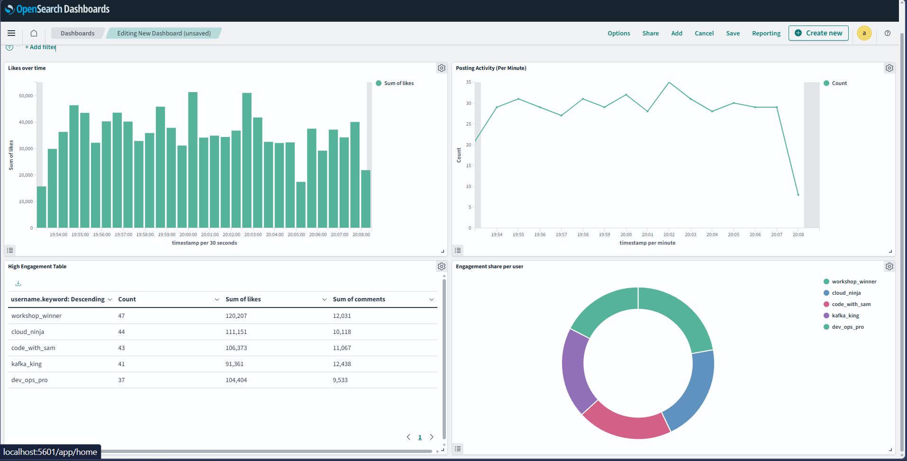
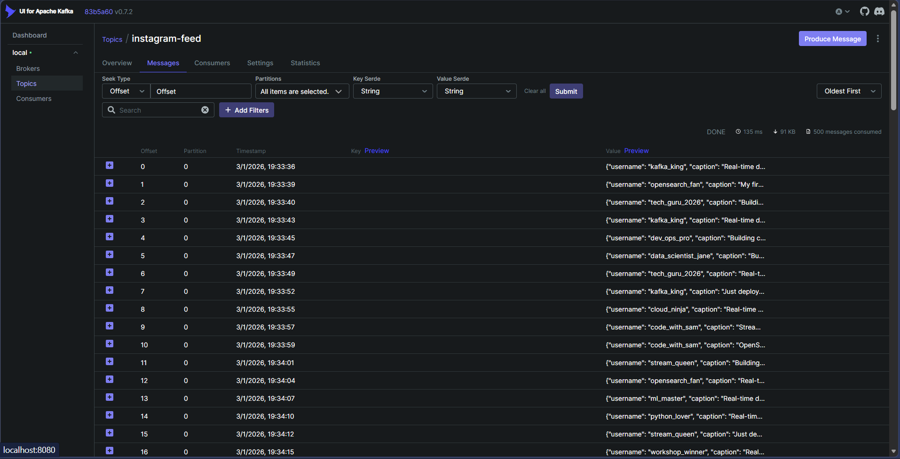
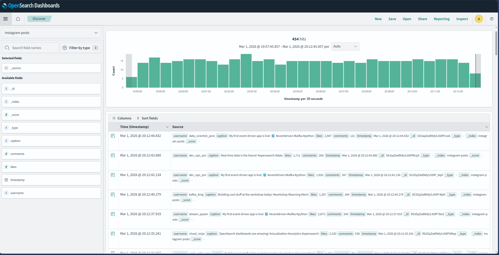

# Instagram Real-Time Analytics Pipeline

A professional, event-driven data pipeline leveraging **Apache Kafka** and **OpenSearch** to simulate, ingest, index,
and visualize Instagram post activity in real time.  The goal of this project is to demonstrate
stream processing, secure search indexing, and analytics dashboarding in a single containerized
solution.

---

## 📸 Screenshots

### OpenSearch Dashboards – Real-Time Analytics



### Kafka Topic – Live Event Stream



### Indexed Documents – OpenSearch Discover



---

## 🏗 Architecture

```
Python Producer  
      ↓
Kafka Topic (instagram-feed)  
      ↓
Kafka Consumer  
      ↓
OpenSearch Index (instagram-posts)  
      ↓
OpenSearch Dashboards
```

All services are orchestrated via `docker-compose` for ease of deployment and teardown.

---

## 🧰 Tech Stack

- Apache Kafka & ZooKeeper
- OpenSearch 2.x
- OpenSearch Dashboards
- Docker & Docker Compose
- Python (`kafka-python`, `opensearch-py`)

---

## ✅ Features

- Real‑time event streaming from a synthetic Instagram generator
- Secure OpenSearch cluster with HTTPS and basic authentication
- Automated index creation with mappings
- Aggregation-based analytics (likes, comments, posting frequency)
- Interactive, visually rich dashboards
- Fully containerized for repeatable local development

---

## 📁 Project Structure

```
.
├── docker-compose.yml        # service definitions
├── producer.py              # Kafka producer simulating Instagram posts
├── kafka_to_opensearch.py   # consumer that indexes into OpenSearch
└── README.md                # this document
```

---

## 🚀 Setup Instructions

1. **Start all services**
   ```sh
   docker compose up -d
   ```
   - Kafka → `localhost:9092`
   - Kafka UI → `http://localhost:8080`
   - OpenSearch → `https://localhost:9200`
   - Dashboards → `http://localhost:5601`

2. **Run the consumer**
   ```sh
   python kafka_to_opensearch.py
   ```

3. **Run the producer** (in a new terminal)
   ```sh
   python producer.py
   ```


---

## 🔍 Sample Output & Query

```
Indexed: tech_guru_2026 | Likes: 3157
Indexed: ai_enthusiast  | Likes: 4708
Indexed: kafka_king     | Likes: 3839
```

Elasticsearch‑style search query:

```http
GET instagram-posts/_search
```

---

## 🎓 Learning Outcomes

- Event‑driven system design and implementation
- Stream processing fundamentals with Kafka
- Real‑time search indexing using OpenSearch
- Building aggregation and analytics queries
- Configuring a secure OpenSearch cluster
- Designing dashboards for operational insight

---

## 🚧 Future Improvements

- Integrate Kafka Streams for processing logic
- Perform sentiment analysis prior to indexing
- Detect trending hashtags and topics
- Add support for horizontal scaling
- Implement CI/CD for deployment automation

---

*Last updated: March 1, 2026*
